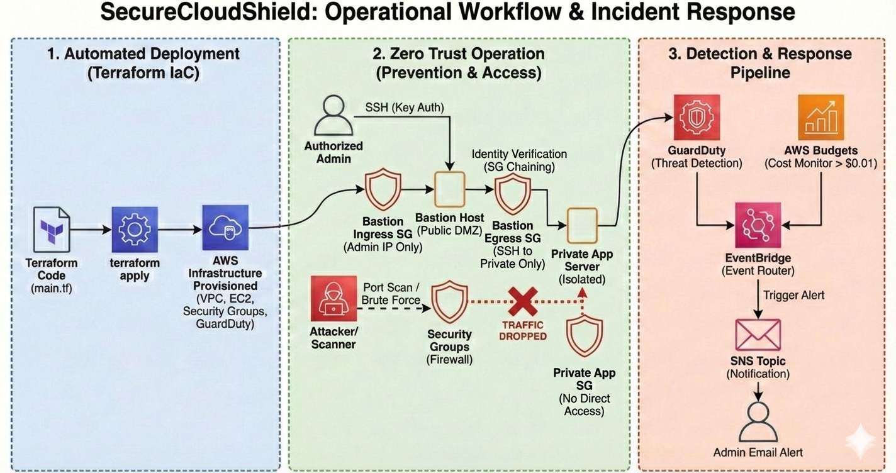

SecureCloudShield: Zero Trust Cloud Architecture 
SecureCloudShield is a fully automated, secure-by-design cloud infrastructure built on AWS using Terraform.

This project demonstrates Infrastructure as Code (IaC), Zero Trust Networking, and Automated Threat Detection. Unlike traditional "perimeter-based" security, this architecture assumes no traffic is trusted by default. It enforces strict identity verification for ingress and total isolation for sensitive data storage.

Architecture Overview
The infrastructure is deployed in the Paris (eu-west-3) region and adheres to Zero Trust principles.

Core Components
Zero Trust Network:

VPC: 10.0.0.0/16 custom isolated network.

Public Subnet (DMZ): Hosts the Bastion Host. Accessible ONLY from the authorized admin's physical IP address.

Private Subnet (Secure Vault): Hosts the internal Application Server. No direct internet route (completely isolated).

Compute:

Bastion Host: Amazon Linux 2023 (t2.micro) acting as the single point of entry.

Private Server: Isolated workload that acts as a "Data Vault" (Ingress only from Bastion; Egress blocked).

Security & Compliance:

Dynamic Identity Lock: Terraform automatically fetches the admin's public IP during deployment to lock the "Front Door."

Strict Egress Filtering: The Private Server cannot initiate outbound connections, preventing data exfiltration and C2 communication.

Amazon GuardDuty: Continuous threat detection (e.g., SSH Brute Force, Port Scanning).

Observability & Response:

EventBridge & SNS: Automated email alerts triggered immediately upon threat detection.

Deployment Guide
Prerequisites
AWS CLI (Configured with credentials)

Terraform (v1.0+)

Git

Installation
Clone the repository:

Bash

git clone git@github.com:hamzasaleem760/SecureCloudShield-AWS-Cloud-Security-.git
cd SecureCloudShield
Initialize Terraform:

Bash

terraform init
Apply the infrastructure:

Bash

terraform apply -auto-approve
This will automatically detect your public IP, lock the Security Groups to your location, and generate the SSH key (thesis_key.pem) locally.

Testing & Validation (Zero Trust Demo)
To prove the "Zero Trust" model works, perform these three tests:

1. The "Identity Lock" Test (Ingress)
Attempt to SSH into the Bastion Host using the generated key.

Bash

ssh -i thesis_key.pem ec2-user@<BASTION_IP>
Success Condition: You connect successfully.

Zero Trust Proof: If you switch networks (e.g., to mobile data) or use a VPN, the connection will Time Out, proving the whitelist works.

2. The "Vault" Isolation Test (Egress)
Once inside the Private Server (via Bastion), try to ping the internet.

Bash

ping google.com
Success Condition: The command HANGS (no response).

Zero Trust Proof: The Private Server is physically incapable of sending data to the internet, neutralizing Data Exfiltration risks.

3. The "Lateral Movement" Test
From the Bastion, try to access any port other than 22 on the Private Server.

Bash

curl http://10.0.2.x:80
Success Condition: Connection Refused / Timeout.

Zero Trust Proof: The Bastion is trusted only for management (SSH), not for general access.
